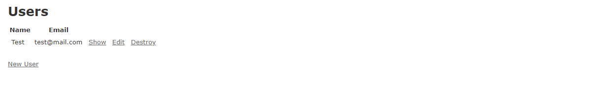

# Toy App (Ruby on Rails)

>  Developing a toy demo application to show off some of the power of Rails.

The purpose is to get a high-level overview of Ruby on Rails programming (and web development in general)
by rapidly generating an application using scaffold generators, which create a large amount of functionality automatically.

## Built With

- Ruby language,
- Ruby on Rails framework,
- Vscode for coding
- Rubocop for Validation

## Live Demo

[Live Demo Link](https://pure-wildwood-19632.herokuapp.com/)

## Getting Started

**start by generating the application skeleton using the rails new command with a specific Rails version number:

$ cd ~/environment
$ rails _6.0.1_ new toy_app
$ cd toy_app/

**Next, we’ll use a text editor to update the Gemfile needed by Bundler.**
**install the local gems while preventing the installation of production gems using the --without production option:

**$ bundle install --without production.**

## Authors

👤 **Selma Ndi**

- Github: [@githubhandle](https://github.com/Datagirlcmr)
- Twitter: [@twitterhandle](https://twitter.com/SelmaNdi)
- Linkedin: [linkedin](https://www.linkedin.com/in/selma-ndi-datagirl-imba-8976ab32/)

👤 **Vinicius Carvalho**

- Github: [@githubhandle](https://github.com/kazumaki)
- Twitter: [@twitterhandle](https://twitter.com/iKazumaki/)
- Linkedin: [linkedin](https://www.linkedin.com/in/vinicius-campos-carvalho-3526a1192/)

## 🤝 Contributing

Contributions, issues and feature requests are welcome!

Feel free to check the [issues page](https://github.com/Datagirlcmr/Toy-App/issues).

## Show your support

Give a ⭐️ if you like this project!

## Acknowledgments

- MicroverseInc(https://www.microverse.org/)
- Rails Tutorial(https://www.railstutorial.org/book/toy_app)

## 📝 License

This project is [MIT](lic.url) licensed.
